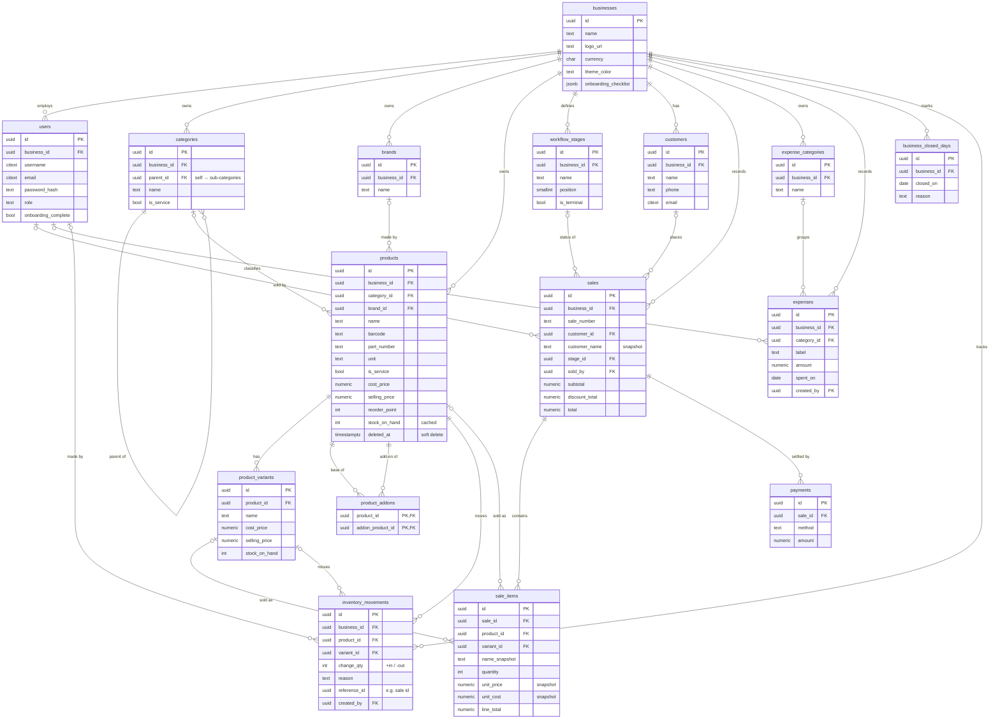

# Database Plan — DC Motorshop & Accessories

> **Scope.** This is the canonical **server-side relational schema (PostgreSQL)** for the future FastAPI backend. The mobile app runs **offline-first on Isar**; this schema is the source of truth that local data syncs up to. The Isar collections are a denormalized local mirror of these tables — see [§9 Local ↔ Server mapping](#9-local--server-mapping).
>
> Target: PostgreSQL 16+. Normal form: **3NF**, with three deliberate, documented denormalizations (financial snapshots, cached stock-on-hand, walk-in customer name).

---

## 1. Design principles (the professional decisions)

| Decision | Choice | Why |
|---|---|---|
| **Primary keys** | `UUID` (v7, time-ordered) | Offline-first: clients generate IDs while disconnected with zero collision risk, so the same row id exists in Isar and Postgres. v7 keeps them index-friendly (roughly insertion-ordered) unlike v4. |
| **Money** | `NUMERIC(12,2)`, never `float` | Binary floats can't represent ₱0.10 exactly → rounding drift in totals. Decimal is mandatory for financial data. |
| **Transaction immutability** | Snapshot `name`, `unit_price`, `unit_cost` onto `sale_items` | A receipt must never change because a product was later re-priced or renamed. COGS/margin reports must reflect the cost *at time of sale*. |
| **Stock** | `inventory_movements` ledger is the source of truth | Append-only audit trail (purchase / sale / adjustment / return). On-hand is `SUM(change_qty)`. Prevents the "lost update" race a single mutable counter suffers. |
| **Timestamps** | `created_at`, `updated_at` (`timestamptz`, UTC) on every table | Auditing + sync conflict resolution (last-write-wins / merge). `updated_at` maintained by a shared trigger. |
| **Soft delete** | `deleted_at timestamptz NULL` on catalog tables | Products/customers referenced by historical sales must not hard-delete. Active rows = `deleted_at IS NULL`. |
| **Case-insensitive text** | `CITEXT` for `username`, `email` | Avoids `LOWER()` everywhere and enforces uniqueness correctly. |
| **Passwords** | single `password_hash` (Argon2id) | Modern KDFs embed the salt in the hash string — no separate salt column. (The local Isar stub uses salt+SHA-256; the server upgrades this.) |
| **Tenancy** | `business_id` FK on all owned tables | The app already models one `BusinessSettings`; carrying `business_id` makes multi-shop / multi-device staff trivial later at near-zero cost now. *Strict single-tenant deployments may drop it.* |
| **Lookups vs enums** | Lookup **tables** for user-editable sets (categories, workflow stages, units, brands); native `enum`/`CHECK` for fixed sets (movement reason, payment method, role) | User-editable data needs rows; fixed vocabularies are constrained in-schema. |
| **Referential actions** | `ON DELETE RESTRICT` for financial FKs, `SET NULL` for optional descriptive FKs | Never let a category delete cascade away sales history. |

---

## 2. Entity overview

```
IDENTITY        businesses ─┬─< users
                            │
CATALOG                     ├─< categories ──< (self parent_id)
                            ├─< brands
                            ├─< products ──< product_variants
                            │       │   └─< product_addons (self M:N)
INVENTORY                   │       └─< inventory_movements
                            │
SALES                       ├─< customers ──< sales ──< sale_items
                            │                   │  └─< payments
                            │                   └── workflow_stages (status)
FINANCE                     ├─< expense_categories ──< expenses
CONFIG                      └─< business_closed_days
```

Legend: `─<` = one-to-many, `>──<` = many-to-many (junction), `(self …)` = self-reference.

---

## 3. Identity

```sql
CREATE TABLE businesses (
    id              uuid PRIMARY KEY DEFAULT uuidv7(),
    name            text NOT NULL,
    logo_url        text,
    address         text,
    phone           text,
    currency        char(3) NOT NULL DEFAULT 'PHP',
    theme_color     text NOT NULL DEFAULT 'Blue',
    -- completed setup-checklist item ids, e.g. ["add_logo","add_product"]
    onboarding_checklist jsonb NOT NULL DEFAULT '[]'::jsonb,
    -- finance config (dashboard "fine-tune" settings)
    expense_avg_months      smallint NOT NULL DEFAULT 3 CHECK (expense_avg_months > 0),
    low_stock_threshold_days smallint,
    created_at      timestamptz NOT NULL DEFAULT now(),
    updated_at      timestamptz NOT NULL DEFAULT now()
);

CREATE TABLE users (
    id              uuid PRIMARY KEY DEFAULT uuidv7(),
    business_id     uuid NOT NULL REFERENCES businesses(id) ON DELETE CASCADE,
    username        citext NOT NULL,
    email           citext NOT NULL,
    password_hash   text NOT NULL,                 -- Argon2id (salt embedded)
    full_name       text,
    phone           text,
    role            text NOT NULL DEFAULT 'owner'
                        CHECK (role IN ('owner','manager','staff')),
    onboarding_complete boolean NOT NULL DEFAULT false,
    created_at      timestamptz NOT NULL DEFAULT now(),
    updated_at      timestamptz NOT NULL DEFAULT now(),
    deleted_at      timestamptz,
    UNIQUE (business_id, username),
    UNIQUE (business_id, email)
);
```

---

## 4. Catalog

```sql
CREATE TABLE categories (
    id          uuid PRIMARY KEY DEFAULT uuidv7(),
    business_id uuid NOT NULL REFERENCES businesses(id) ON DELETE CASCADE,
    parent_id   uuid REFERENCES categories(id) ON DELETE SET NULL,  -- sub-categories
    name        text NOT NULL,
    is_service  boolean NOT NULL DEFAULT false,
    created_at  timestamptz NOT NULL DEFAULT now(),
    updated_at  timestamptz NOT NULL DEFAULT now(),
    UNIQUE (business_id, parent_id, name)
);

CREATE TABLE brands (
    id          uuid PRIMARY KEY DEFAULT uuidv7(),
    business_id uuid NOT NULL REFERENCES businesses(id) ON DELETE CASCADE,
    name        text NOT NULL,
    UNIQUE (business_id, name)
);

CREATE TABLE products (
    id            uuid PRIMARY KEY DEFAULT uuidv7(),
    business_id   uuid NOT NULL REFERENCES businesses(id) ON DELETE CASCADE,
    category_id   uuid REFERENCES categories(id) ON DELETE SET NULL,
    brand_id      uuid REFERENCES brands(id) ON DELETE SET NULL,
    name          text NOT NULL,
    sku           text,
    barcode       text,
    part_number   text,
    description   text,
    unit          text NOT NULL DEFAULT 'piece'
                      CHECK (unit IN ('piece','liter','set','pair','box')),
    is_service    boolean NOT NULL DEFAULT false,
    cost_price    numeric(12,2) NOT NULL DEFAULT 0 CHECK (cost_price >= 0),
    selling_price numeric(12,2) NOT NULL DEFAULT 0 CHECK (selling_price >= 0),
    reorder_point integer NOT NULL DEFAULT 0,         -- low-stock alert threshold
    stock_on_hand integer NOT NULL DEFAULT 0,         -- CACHED, see §6
    image_url     text,
    created_at    timestamptz NOT NULL DEFAULT now(),
    updated_at    timestamptz NOT NULL DEFAULT now(),
    deleted_at    timestamptz,
    UNIQUE (business_id, barcode)          -- partial: enforced only when barcode NOT NULL
);
CREATE UNIQUE INDEX products_barcode_uq
    ON products (business_id, barcode) WHERE barcode IS NOT NULL;
CREATE INDEX products_business_active_idx
    ON products (business_id) WHERE deleted_at IS NULL;

-- Variants: sizes / colors / options for one product.
CREATE TABLE product_variants (
    id            uuid PRIMARY KEY DEFAULT uuidv7(),
    product_id    uuid NOT NULL REFERENCES products(id) ON DELETE CASCADE,
    name          text NOT NULL,            -- "Red / Large"
    sku           text,
    barcode       text,
    cost_price    numeric(12,2),            -- NULL = inherit from product
    selling_price numeric(12,2),
    stock_on_hand integer NOT NULL DEFAULT 0,
    created_at    timestamptz NOT NULL DEFAULT now(),
    updated_at    timestamptz NOT NULL DEFAULT now()
);

-- M:N self-reference — optional add-ons linked to a base product.
CREATE TABLE product_addons (
    product_id       uuid NOT NULL REFERENCES products(id) ON DELETE CASCADE,
    addon_product_id uuid NOT NULL REFERENCES products(id) ON DELETE CASCADE,
    PRIMARY KEY (product_id, addon_product_id),
    CHECK (product_id <> addon_product_id)
);
```

---

## 5. Sales

```sql
CREATE TABLE workflow_stages (
    id          uuid PRIMARY KEY DEFAULT uuidv7(),
    business_id uuid NOT NULL REFERENCES businesses(id) ON DELETE CASCADE,
    name        text NOT NULL,             -- Pending, Processing, Completed
    position    smallint NOT NULL,         -- display / progression order
    is_terminal boolean NOT NULL DEFAULT false,
    UNIQUE (business_id, position),
    UNIQUE (business_id, name)
);

CREATE TABLE customers (
    id          uuid PRIMARY KEY DEFAULT uuidv7(),
    business_id uuid NOT NULL REFERENCES businesses(id) ON DELETE CASCADE,
    name        text NOT NULL,
    phone       text,
    email       citext,
    created_at  timestamptz NOT NULL DEFAULT now(),
    updated_at  timestamptz NOT NULL DEFAULT now(),
    deleted_at  timestamptz
);

CREATE TABLE sales (
    id            uuid PRIMARY KEY DEFAULT uuidv7(),
    business_id   uuid NOT NULL REFERENCES businesses(id) ON DELETE CASCADE,
    sale_number   text NOT NULL,                       -- "S-0001"
    customer_id   uuid REFERENCES customers(id) ON DELETE SET NULL,
    customer_name text,                                -- snapshot for walk-ins (denormalized)
    stage_id      uuid REFERENCES workflow_stages(id) ON DELETE RESTRICT,
    sold_by       uuid REFERENCES users(id) ON DELETE SET NULL,
    subtotal      numeric(12,2) NOT NULL DEFAULT 0,
    discount_total numeric(12,2) NOT NULL DEFAULT 0,
    tax_total     numeric(12,2) NOT NULL DEFAULT 0,
    total         numeric(12,2) NOT NULL DEFAULT 0,
    created_at    timestamptz NOT NULL DEFAULT now(),
    updated_at    timestamptz NOT NULL DEFAULT now(),
    UNIQUE (business_id, sale_number)
);
CREATE INDEX sales_business_created_idx ON sales (business_id, created_at DESC);

CREATE TABLE sale_items (
    id            uuid PRIMARY KEY DEFAULT uuidv7(),
    sale_id       uuid NOT NULL REFERENCES sales(id) ON DELETE CASCADE,
    product_id    uuid REFERENCES products(id) ON DELETE SET NULL,
    variant_id    uuid REFERENCES product_variants(id) ON DELETE SET NULL,
    name_snapshot text NOT NULL,                       -- product name at sale time
    quantity      integer NOT NULL CHECK (quantity > 0),
    unit_price    numeric(12,2) NOT NULL,              -- snapshot
    unit_cost     numeric(12,2) NOT NULL DEFAULT 0,    -- snapshot (for COGS)
    discount      numeric(12,2) NOT NULL DEFAULT 0,
    line_total    numeric(12,2) NOT NULL
);
CREATE INDEX sale_items_sale_idx ON sale_items (sale_id);

CREATE TABLE payments (
    id         uuid PRIMARY KEY DEFAULT uuidv7(),
    sale_id    uuid NOT NULL REFERENCES sales(id) ON DELETE CASCADE,
    method     text NOT NULL CHECK (method IN ('cash','gcash','card','bank','other')),
    amount     numeric(12,2) NOT NULL CHECK (amount > 0),
    created_at timestamptz NOT NULL DEFAULT now()
);
```

> `payments` supports split tender (cash + GCash). MVP can insert a single `cash` row equal to `sales.total`.

---

## 6. Inventory ledger

```sql
CREATE TABLE inventory_movements (
    id            uuid PRIMARY KEY DEFAULT uuidv7(),
    business_id   uuid NOT NULL REFERENCES businesses(id) ON DELETE CASCADE,
    product_id    uuid NOT NULL REFERENCES products(id) ON DELETE RESTRICT,
    variant_id    uuid REFERENCES product_variants(id) ON DELETE RESTRICT,
    change_qty    integer NOT NULL,                    -- +in / -out (never 0)
    reason        text NOT NULL CHECK (reason IN
                      ('initial','purchase','sale','adjustment','return')),
    reference_type text,                               -- e.g. 'sale'
    reference_id   uuid,                               -- e.g. sales.id
    note          text,
    created_by    uuid REFERENCES users(id) ON DELETE SET NULL,
    created_at    timestamptz NOT NULL DEFAULT now(),
    CHECK (change_qty <> 0)
);
CREATE INDEX inv_mov_product_idx ON inventory_movements (product_id, created_at);
```

**On-hand is derived:** `SELECT COALESCE(SUM(change_qty),0) FROM inventory_movements WHERE product_id = $1`.
`products.stock_on_hand` is a **cached** copy kept in sync by an `AFTER INSERT` trigger on `inventory_movements`. The ledger is authoritative; the cache exists only so list screens don't aggregate on every read. A checkout inserts a `sale` + a negative `sale` movement per line in one transaction.

---

## 7. Finance & config

```sql
CREATE TABLE expense_categories (
    id          uuid PRIMARY KEY DEFAULT uuidv7(),
    business_id uuid NOT NULL REFERENCES businesses(id) ON DELETE CASCADE,
    name        text NOT NULL,                         -- Rent, Utilities, Supplies
    UNIQUE (business_id, name)
);

CREATE TABLE expenses (
    id          uuid PRIMARY KEY DEFAULT uuidv7(),
    business_id uuid NOT NULL REFERENCES businesses(id) ON DELETE CASCADE,
    category_id uuid REFERENCES expense_categories(id) ON DELETE SET NULL,
    label       text NOT NULL,
    amount      numeric(12,2) NOT NULL CHECK (amount > 0),
    spent_on    date NOT NULL DEFAULT CURRENT_DATE,
    note        text,
    created_by  uuid REFERENCES users(id) ON DELETE SET NULL,
    created_at  timestamptz NOT NULL DEFAULT now(),
    updated_at  timestamptz NOT NULL DEFAULT now()
);
CREATE INDEX expenses_business_date_idx ON expenses (business_id, spent_on);

-- Drives the "closed days" feature so daily targets exclude non-trading days.
CREATE TABLE business_closed_days (
    id          uuid PRIMARY KEY DEFAULT uuidv7(),
    business_id uuid NOT NULL REFERENCES businesses(id) ON DELETE CASCADE,
    closed_on   date NOT NULL,
    reason      text,
    UNIQUE (business_id, closed_on)
);
```

---

## 8. Cross-cutting

- **`updated_at` trigger** — one `set_updated_at()` function attached `BEFORE UPDATE` to every table that has the column.
- **Extensions** — `citext` (case-insensitive text); `uuidv7()` is native in PG18, else use the `pg_uuidv7` extension or generate client-side.
- **Dashboard metrics** are *computed*, never stored: revenue = `SUM(sales.total)`, COGS = `SUM(sale_items.unit_cost * quantity)`, gross profit = revenue − COGS, net profit = gross − expenses, margin = gross / revenue. Scoped by `created_at`/`spent_on` date range.
- **Migrations** — Alembic. Creation order respects FKs: businesses → users → (brands, categories, workflow_stages, expense_categories, customers) → products → (variants, addons) → sales → (sale_items, payments) → inventory_movements → expenses → closed_days.

---

## 9. Local ↔ Server mapping

The Isar local models are a **denormalized mirror** for offline speed; the server normalizes them.

| Isar (local, now) | Server (normalized) | Reconciliation on sync |
|---|---|---|
| `BusinessSettings.completedChecklistItems` (List<String>) | `businesses.onboarding_checklist` (jsonb) | stored as a JSON array of item ids |
| `Product.category` (string) | `products.category_id` → `categories` | resolve/create category by name within business |
| `Product.brand` (string) | `products.brand_id` → `brands` | resolve/create brand |
| `Product.stockQty` (int) | `inventory_movements` ledger + cached `stock_on_hand` | local edits emit `adjustment` movements |
| `Sale.items` (embedded) | `sale_items` rows | expand embedded list to rows |
| `Sale.customerName` (string) | `customers` + `sales.customer_name` snapshot | match/create customer; keep snapshot |
| `double` money | `numeric(12,2)` | round half-up to 2dp at sync boundary |
| `Isar.autoIncrement` int id | `uuid` | **migration note:** switch local PKs to UUIDv7 before enabling sync so ids line up |

**Sync model:** each table carries `updated_at`; the client tracks a per-record dirty flag and pushes changes on reconnect. Conflict policy: last-write-wins by `updated_at` for catalog/config; **sales & inventory_movements are append-only and never updated**, so they merge without conflict.

---

## 10. Intentionally out of scope (now)

- Purchase orders / supplier management — add a `suppliers` + `purchase_orders` module when restocking workflows are built; `inventory_movements.reason='purchase'` already reserves the hook.
- Tax tables — `sales.tax_total` column reserved; rates can stay app-config until VAT handling is needed.
- Full RBAC/permissions — `users.role` covers the near term.
- Loyalty / store credit, multi-currency.

---

## 11. ERD (visual)

Render this anywhere that supports Mermaid: paste into **[mermaid.live](https://mermaid.live)**, view on GitHub, or install the **"Markdown Preview Mermaid Support"** VS Code extension and open the preview (`Ctrl+Shift+V`). Crow's-foot notation: `||` = one, `o{` = many, `o|` = zero-or-one.


